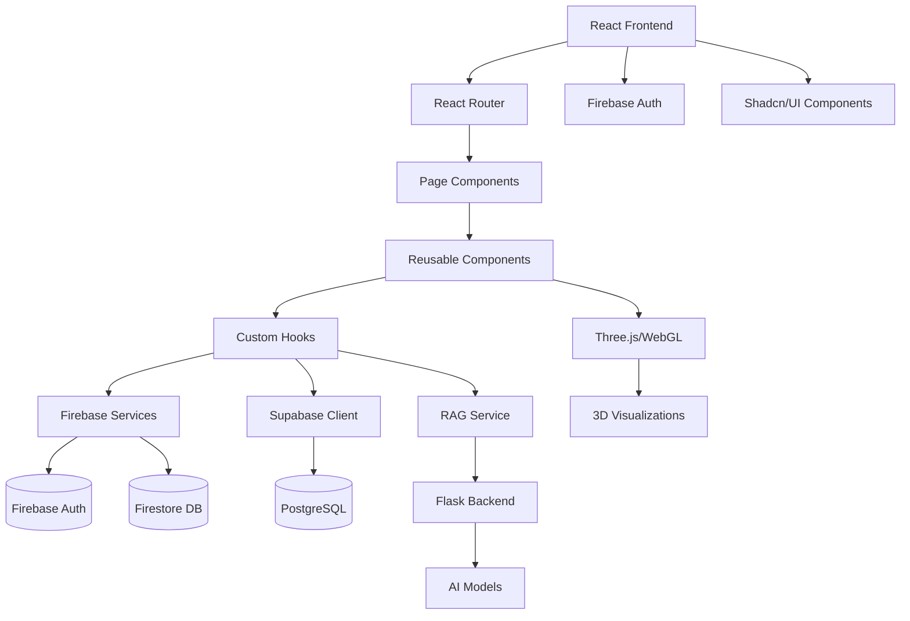

# 🌊 FloatChat - Ocean Intelligence Platform

A comprehensive oceanographic monitoring and analysis platform powered by AI, featuring real-time data visualization, interactive chatbot, and advanced marine analytics.

## 📋 Table of Contents

- [Overview](#-overview)
- [Architecture](#-architecture)
- [Features](#-features)
- [Technology Stack](#️-technology-stack)
- [Project Structure](#-project-structure)
- [Getting Started](#-getting-started)
- [API Documentation](#-api-documentation)
- [Component Guide](#-component-guide)
- [Data Flow](#-data-flow)
- [Deployment](#-deployment)
- [Contributing](#-contributing)

## 🔍 Overview

FloatChat represents a cutting-edge solution for oceanographic research and monitoring, combining modern web technologies with advanced AI capabilities. The platform serves researchers, marine biologists, environmental scientists, and educational institutions by providing intuitive access to complex oceanographic data through conversational AI and interactive visualizations.

### Problem Statement
Traditional oceanographic data analysis tools are often:
- Complex and require specialized knowledge
- Limited in real-time data processing
- Lack intuitive user interfaces
- Don't provide conversational data exploration
- Expensive and difficult to integrate

### Solution
FloatChat addresses these challenges by:
- **Conversational AI Interface**: Natural language queries for data exploration
- **Real-time Processing**: Live oceanographic data integration
- **Intuitive Visualizations**: Interactive charts, 3D environments, and geographic mapping
- **Multi-source Integration**: Firebase, Supabase, and external APIs
- **Responsive Design**: Works across all devices and platforms
- **Scalable Architecture**: Handles large datasets efficiently

### Key Benefits
- 🚀 **Accelerated Research**: Reduce data analysis time from hours to minutes
- 🎯 **Improved Accessibility**: Make oceanographic data accessible to non-experts
- 📊 **Enhanced Insights**: AI-powered pattern recognition and trend analysis
- 🌐 **Real-time Monitoring**: Live environmental data tracking
- 💡 **Educational Value**: Interactive learning platform for marine science

## 🚀 Features

### 🤖 AI-Powered Chatbot
- **Intelligent Marine Conversations**: Advanced AI chatbot specialized in oceanographic data analysis
- **Multi-threaded Chat Sessions**: Create and manage multiple conversation threads
- **Voice Recognition**: Voice input support for hands-free interaction
- **File Upload Support**: Upload and analyze marine data files
- **Real-time Data Integration**: Access live oceanographic data through conversational AI

### 📊 Data Visualization & Analytics
- **Interactive Dashboards**: Comprehensive ocean analytics with real-time metrics
- **Advanced Charts**: Temperature trends, marine life distribution, species analysis
- **3D Visualizations**: Immersive ocean data representation
- **Real-time Monitoring**: Live oceanographic sensor data
- **Heatmaps & Scatter Plots**: Complex data relationship visualization
- **Geographic Mapping**: Interactive ocean region mapping

### 🗺️ Ocean Explorer
- **Interactive Ocean Maps**: Explore different ocean regions with detailed data
- **Marine Life Tracking**: Species distribution and population analytics
- **Environmental Monitoring**: Temperature, salinity, pH level tracking
- **Data Inspection Tools**: Deep dive into oceanographic datasets

### 💼 Pricing & Plans
- **Flexible Pricing Tiers**: From research institutions to enterprise solutions
- **Academic Discounts**: Special pricing for educational institutions
- **Enterprise Features**: Advanced analytics and custom integrations
- **API Access**: Programmatic access to ocean data

## 🏗️ Architecture

FloatChat follows a modern, microservices-inspired architecture with clear separation of concerns:

### System Architecture


### Data Flow Architecture
1. **Authentication Layer**: Firebase handles user authentication and session management
2. **Data Layer**: Supabase PostgreSQL stores oceanographic data with real-time subscriptions
3. **AI Layer**: Flask backend processes natural language queries using RAG (Retrieval-Augmented Generation)
4. **Presentation Layer**: React components render data with Three.js for 3D visualizations
5. **State Management**: React hooks manage local state with React Query for server state

### Security Architecture
- **Authentication**: Firebase Auth with email/password and social providers
- **Authorization**: Role-based access control with Firebase Security Rules
- **Data Protection**: HTTPS/TLS encryption in transit
- **Input Validation**: Client and server-side validation
- **API Security**: CORS policies and rate limiting

## 🛠️ Technology Stack

### Frontend
- **React 18** with TypeScript for robust type safety
- **Vite** for fast development and building
- **Tailwind CSS** for responsive, modern UI design
- **Framer Motion** for smooth animations and transitions
- **Three.js** with React Three Fiber for 3D visualizations
- **Recharts** for interactive data visualization
- **React Router** for client-side routing

### Backend & Data
- **Firebase** for authentication and real-time database
- **Supabase** for advanced database operations and real-time features
- **React Query** for efficient data fetching and caching

### UI Components
- **Radix UI** for accessible, unstyled UI primitives
- **Shadcn/ui** for beautiful, customizable components
- **Lucide React** for consistent iconography
- **Sonner** for elegant toast notifications

### 3D & Visualization
- **Three.js** for WebGL-based 3D graphics
- **React Three Drei** for Three.js utilities
- **Hyperspeed** component for advanced 3D backgrounds
- **Leaflet** for interactive maps

## 📁 Project Structure

```
FloatChat/
├── public/                     # Static assets
│   ├── vite.svg               # Vite logo
│   └── lovable-uploads/       # User uploaded assets
├── src/
│   ├── components/            # Reusable UI components
│   │   ├── ui/               # Base UI components (Shadcn/ui)
│   │   │   ├── button.tsx    # Button component
│   │   │   ├── card.tsx      # Card component
│   │   │   ├── input.tsx     # Input component
│   │   │   └── ...           # Other UI primitives
│   │   ├── Navbar.tsx        # Main navigation component
│   │   ├── Hyperspeed.tsx    # Advanced 3D background (Three.js)
│   │   ├── SimpleMap.tsx     # Interactive ocean maps (Leaflet)
│   │   ├── ARVROceanBackground.tsx # AR/VR ocean environments
│   │   ├── DataInspector.tsx # Data analysis component
│   │   ├── RagPlotDisplay.tsx # AI-generated plot display
│   │   └── SupabaseTest.tsx  # Database connection testing
│   ├── pages/                # Page-level components
│   │   ├── OceanLaunch.tsx   # Landing/splash page with 3D effects
│   │   ├── Landing.tsx       # Main homepage
│   │   ├── AIChatbot.tsx     # Conversational AI interface (1204 lines)
│   │   ├── DataVisualization.tsx # Analytics dashboard (1684 lines)
│   │   ├── OceanExplorer.tsx # Interactive ocean exploration (1387 lines)
│   │   ├── Pricing.tsx       # Subscription plans and pricing
│   │   ├── Auth.tsx          # Authentication forms
│   │   ├── DataInspection.tsx # Raw data inspection tools
│   │   ├── OceanMapSimple.tsx # Simplified mapping interface
│   │   └── NotFound.tsx      # 404 error page
│   ├── services/             # External API integrations
│   │   ├── ragService.ts     # RAG-based AI query processing
│   │   ├── chatService.ts    # Chat thread management (Firebase)
│   │   ├── mistralService.ts # Mistral AI integration (437 lines)
│   │   └── dataTransform.ts  # Data processing and transformation
│   ├── hooks/                # Custom React hooks
│   │   ├── useRealSupabaseData.ts # Real-time Supabase data
│   │   ├── useSupabaseData.ts     # Supabase data operations
│   │   ├── useArgoData.ts         # Argo oceanographic data
│   │   ├── useActualSupabaseData.ts # Alternative data hook
│   │   └── use-toast.ts           # Toast notification hook
│   ├── lib/                  # Core utilities and configurations
│   │   ├── firebase.ts       # Firebase configuration and auth
│   │   ├── supabase.ts       # Supabase client configuration
│   │   ├── auth-context.tsx  # Authentication context provider
│   │   └── utils.ts          # Utility functions (cn, etc.)
│   ├── types/                # TypeScript type definitions
│   │   └── index.ts          # Global type exports
│   ├── App.tsx               # Main application component
│   ├── main.tsx              # Application entry point
│   └── index.css             # Global styles and CSS variables
├── package.json              # Dependencies and scripts
├── tailwind.config.ts        # Tailwind CSS configuration
├── tsconfig.json             # TypeScript configuration
├── vite.config.ts            # Vite build configuration
├── eslint.config.js          # ESLint configuration
└── README.md                 # Project documentation
```

### Component Architecture

#### Core Components (High-level)
- **OceanLaunch.tsx**: Immersive 3D landing experience with Hyperspeed backgrounds
- **AIChatbot.tsx**: Multi-threaded conversational AI with voice recognition
- **DataVisualization.tsx**: Comprehensive analytics dashboard with real-time charts
- **OceanExplorer.tsx**: Interactive 3D ocean environment exploration

#### UI Components (Low-level)
- **Shadcn/ui**: Accessible, composable UI primitives
- **Custom Components**: Domain-specific oceanographic visualizations
- **3D Components**: Three.js powered immersive experiences

#### Service Layer
- **Data Services**: Supabase integration, real-time subscriptions
- **AI Services**: RAG queries, natural language processing
- **Authentication**: Firebase Auth integration

## 🚦 Getting Started

### Prerequisites
- Node.js (v18 or higher)
- npm or yarn package manager
- Modern web browser with WebGL support

### Installation

1. **Clone the repository**
   ```bash
   git clone <repository-url>
   cd SIH
   ```

2. **Install dependencies**
   ```bash
   npm install
   ```

3. **Environment Setup**
   Create a `.env` file in the root directory:
   ```env
   VITE_FIREBASE_API_KEY=your_firebase_api_key
   VITE_FIREBASE_AUTH_DOMAIN=your_firebase_auth_domain
   VITE_FIREBASE_PROJECT_ID=your_firebase_project_id
   VITE_SUPABASE_URL=your_supabase_url
   VITE_SUPABASE_ANON_KEY=your_supabase_anon_key
   ```

4. **Start development server**
   ```bash
   npm run dev
   ```

5. **Open your browser**
   Navigate to `http://localhost:5173` to view the application

### Building for Production

```bash
# Build the project
npm run build

# Preview the production build
npm run preview
```

## 🔧 Available Scripts

- `npm run dev` - Start development server
- `npm run build` - Build for production
- `npm run build:dev` - Build in development mode
- `npm run lint` - Run ESLint for code quality
- `npm run preview` - Preview production build locally

## 📚 API Documentation

### RAG Service API
The RAG (Retrieval-Augmented Generation) service processes natural language queries and returns structured responses with visualizations.

#### Endpoint: `/query`
```typescript
interface RagResponse {
  answer: string;
  used_tables: string[];
  suggested_visualizations: string[];
  candidates: Array<{
    table: string;
    explaination: string;
    row_count: number;
  }>;
  plots: Array<{
    type: string;
    title: string;
    data: Array<{ x: number[]; y: number[]; }>;
    base64: string;
  }>;
}
```

### Firebase Services
```typescript
// Authentication
export const createUser = (email: string, password: string) => Promise<UserCredential>
export const signIn = (email: string, password: string) => Promise<UserCredential>
export const logOut = () => Promise<void>

// Chat Management
export const createNewChat = (userId: string) => Promise<string>
export const saveMessage = (userId: string, chatId: string, message: ChatMessage) => Promise<void>
export const loadMessages = (userId: string, chatId: string) => Promise<ChatMessage[]>
```

### Supabase Integration
```typescript
// Real-time data hooks
export const useRealSupabaseData = () => {
  return {
    temperatureData: any[];
    marineLifeData: any[];
    metricsData: any[];
    heatmapData: any[];
    scatterData: any[];
    speciesDistribution: any[];
    realTimeMetrics: any;
    loading: boolean;
    error: string | null;
  };
}
```

## 🧩 Component Guide

### Core Page Components

#### AIChatbot.tsx
**Purpose**: Multi-threaded conversational AI interface
**Features**:
- Voice recognition with speech-to-text
- File upload support for data analysis
- Real-time chat with AI responses
- Session management and history
- Dynamic chart generation from conversations

**Key Hooks**:
- `useChatThreadLoader`: Manages chat thread switching
- `useState`: Local state for messages, typing indicators
- `useAuth`: User authentication context

#### DataVisualization.tsx
**Purpose**: Comprehensive oceanographic data dashboard
**Features**:
- Real-time metrics display
- Interactive charts (Bar, Line, Pie, Scatter)
- Heatmap visualizations
- Geographic mapping integration
- Data filtering and time-range selection

**Dependencies**:
- Recharts for data visualization
- useRealSupabaseData for live data
- Framer Motion for animations

#### OceanExplorer.tsx
**Purpose**: 3D interactive ocean environment
**Features**:
- Three.js powered 3D ocean scenes
- Interactive marine life exploration
- Environmental data overlays
- Camera controls and navigation
- Real-time data integration

### 3D Visualization Components

#### Hyperspeed.tsx
**Purpose**: Advanced 3D background effects
**Technical Details**:
- Three.js WebGL rendering
- Custom shader materials
- Particle systems for ocean effects
- Performance optimized rendering
- Configurable visual presets

```typescript
interface HyperspeedProps {
  effectOptions: {
    colors: {
      roadColor: number;
      islandColor: number;
      background: number;
      shoulderLines: number;
      brokenLines: number;
      leftCars: number[];
      rightCars: number[];
      sticks: number;
    };
    distortion: string;
    length: number;
    roadWidth: number;
    fov: number;
    totalSideLightSticks: number;
  };
}
```

### Custom Hooks

#### useRealSupabaseData
**Purpose**: Real-time oceanographic data management
**Returns**: Structured data objects with loading states
**Features**:
- Automatic data fetching
- Real-time subscriptions
- Error handling
- Data transformation

#### useAuth
**Purpose**: Authentication state management
**Returns**: Current user, authentication status
**Features**:
- Firebase Auth integration
- Persistent sessions
- Login/logout handling

## 📊 Data Flow

### Authentication Flow
1. User submits credentials → Firebase Auth
2. Firebase returns JWT token
3. Token stored in browser storage
4. Token validated on protected routes
5. User context updated across app

### Data Visualization Flow
1. Component mounts → useRealSupabaseData hook triggered
2. Hook fetches data from Supabase PostgreSQL
3. Data transformed using dataTransform.ts utilities
4. Recharts components render visualizations
5. Real-time updates via Supabase subscriptions

### AI Chat Flow
1. User enters query → AIChatbot component
2. Query sent to RAG service (Flask backend)
3. RAG service processes with AI models
4. Response includes answer + visualizations
5. Chat history saved to Firebase Firestore
6. Dynamic charts rendered in chat interface

### 3D Rendering Flow
1. Component initializes → Three.js scene creation
2. Hyperspeed component loads shaders and materials
3. Animation loop started for real-time rendering
4. User interactions update camera/scene
5. Performance monitoring and optimization

## 🌊 Key Features Deep Dive

### AI Chatbot Capabilities
- **Marine Data Analysis**: Ask questions about ocean temperature, marine life, water quality
- **Trend Analysis**: Get insights about environmental changes over time
- **Species Information**: Learn about marine ecosystems and biodiversity
- **Data Visualization**: Generate charts and graphs through conversational commands

### Advanced Analytics
- **Real-time Metrics**: Live ocean sensor data monitoring
- **Historical Analysis**: Trend analysis across different time periods
- **Multi-dimensional Data**: Temperature, salinity, pH, species population
- **Geographic Insights**: Region-specific ocean analytics

### 3D Visualization Features
- **Immersive Backgrounds**: Advanced 3D ocean environments
- **Interactive Elements**: Floating data nodes and tech indicators
- **Smooth Animations**: Framer Motion powered transitions
- **Responsive Design**: Optimized for all screen sizes

## 🎨 Design System

- **Color Palette**: Ocean-inspired blues, teals, and emerald greens
- **Typography**: Modern, technical aesthetic with gradient text effects
- **Animations**: Smooth, purposeful motion design
- **Accessibility**: WCAG compliant with keyboard navigation support

## 🔐 Authentication & Security

- **Firebase Authentication**: Secure user authentication
- **Protected Routes**: Route-level authentication guards
- **Real-time Authorization**: Dynamic permission handling
- **Session Management**: Persistent user sessions

## 📱 Responsive Design

- **Mobile First**: Optimized for mobile devices
- **Tablet Support**: Enhanced experience on tablets
- **Desktop Enhanced**: Full feature set on desktop
- **Touch Friendly**: Optimized touch interactions

## 🚀 Deployment

### Environment Variables
Create a `.env` file with the following variables:

```env
# Firebase Configuration
VITE_FIREBASE_API_KEY=your_firebase_api_key
VITE_FIREBASE_AUTH_DOMAIN=your_project.firebaseapp.com
VITE_FIREBASE_PROJECT_ID=your_project_id
VITE_FIREBASE_STORAGE_BUCKET=your_project.appspot.com
VITE_FIREBASE_MESSAGING_SENDER_ID=your_sender_id
VITE_FIREBASE_APP_ID=your_app_id

# Supabase Configuration
VITE_SUPABASE_URL=https://your-project.supabase.co
VITE_SUPABASE_ANON_KEY=your_supabase_anon_key

# External APIs (Optional)
VITE_RAG_SERVICE_URL=http://localhost:5000
VITE_MISTRAL_API_KEY=your_mistral_api_key
```

### Production Build
```bash
# Install dependencies
npm install

# Build for production
npm run build

# Preview production build
npm run preview
```

### Deployment Options

#### Vercel (Recommended)
1. Connect your GitHub repository to Vercel
2. Add environment variables in Vercel dashboard
3. Deploy automatically on push to main branch

#### Netlify
1. Connect repository to Netlify
2. Build command: `npm run build`
3. Publish directory: `dist`
4. Add environment variables in Netlify settings

#### Firebase Hosting
```bash
# Install Firebase CLI
npm install -g firebase-tools

# Login and initialize
firebase login
firebase init hosting

# Build and deploy
npm run build
firebase deploy
```

### Docker Deployment
```dockerfile
# Dockerfile
FROM node:18-alpine

WORKDIR /app
COPY package*.json ./
RUN npm install

COPY . .
RUN npm run build

FROM nginx:alpine
COPY --from=0 /app/dist /usr/share/nginx/html
EXPOSE 80
CMD ["nginx", "-g", "daemon off;"]
```

### Performance Optimizations
- **Code Splitting**: Implemented via React Router lazy loading
- **Image Optimization**: Use WebP format for images
- **Bundle Analysis**: Run `npm run build` and analyze bundle size
- **CDN**: Serve static assets from CDN in production
- **Caching**: Configure proper caching headers for assets

### Monitoring and Analytics
- **Error Tracking**: Integrate with Sentry or similar
- **Performance**: Use Web Vitals monitoring
- **User Analytics**: Optional Google Analytics integration
- **Uptime Monitoring**: Use services like UptimeRobot

## 🔧 Development Workflow

### Code Quality
```bash
# Run linting
npm run lint

# Type checking
npx tsc --noEmit

# Format code
npx prettier --write .
```

### Testing (Future Enhancement)
```bash
# Unit tests (to be implemented)
npm test

# E2E tests (to be implemented)
npm run test:e2e
```

### Git Workflow
1. Create feature branch from `main`
2. Make changes with descriptive commits
3. Push branch and create pull request
4. Code review and merge to `main`
5. Automatic deployment to production

### Database Migrations
For Supabase schema changes:
1. Update schema in Supabase dashboard
2. Export schema: `supabase db dump --schema public`
3. Version control schema changes
4. Update TypeScript types accordingly

## 🤝 Contributing

### Development Setup
1. **Fork the repository**
   ```bash
   git clone https://github.com/yourusername/floatchat.git
   cd floatchat
   ```

2. **Install dependencies**
   ```bash
   npm install
   ```

3. **Set up environment**
   ```bash
   cp .env.example .env
   # Edit .env with your configuration
   ```

4. **Start development server**
   ```bash
   npm run dev
   ```

### Contribution Guidelines
- **Code Style**: Follow existing patterns, use TypeScript strictly
- **Components**: Use functional components with hooks
- **Styling**: Use Tailwind CSS classes, avoid custom CSS when possible
- **State Management**: Use React hooks, React Query for server state
- **Testing**: Add tests for new features (when testing is implemented)
- **Documentation**: Update README for significant changes

### Pull Request Process
1. Create feature branch (`git checkout -b feature/AmazingFeature`)
2. Make changes with clear commit messages
3. Test changes locally
4. Update documentation if needed
5. Submit pull request with description
6. Address review feedback
7. Merge after approval

### Issue Reporting
When reporting bugs, please include:
- Browser and version
- Steps to reproduce
- Expected vs actual behavior
- Screenshots if applicable
- Console errors if any

## 📄 License

This project is licensed under the MIT License - see the LICENSE file for details.

## 🙋 Support

For support and questions:
- Create an issue in the GitHub repository
- Check the documentation in the `/docs` folder
- Contact the development team

## 🌟 Acknowledgments

- **Ocean Data Providers** for real-time oceanographic data
- **Open Source Community** for the amazing libraries and tools
- **Research Institutions** for marine science collaboration
- **SIH Team** for project development and innovation

---

**Built with 💙 for ocean conservation and marine research**
